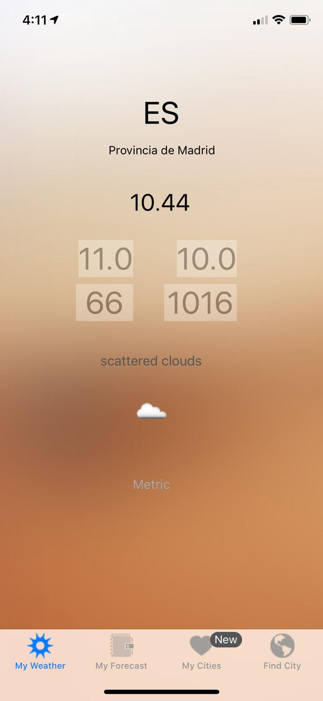
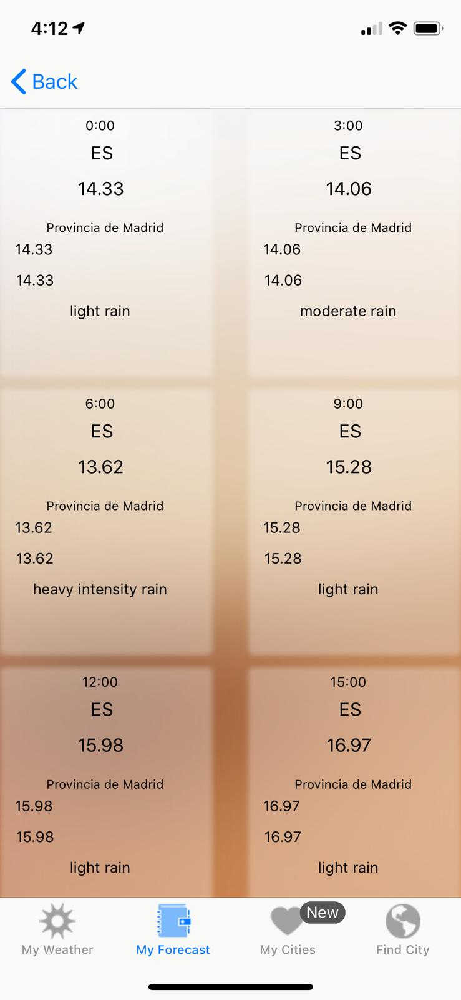
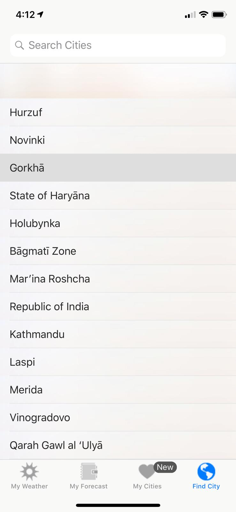
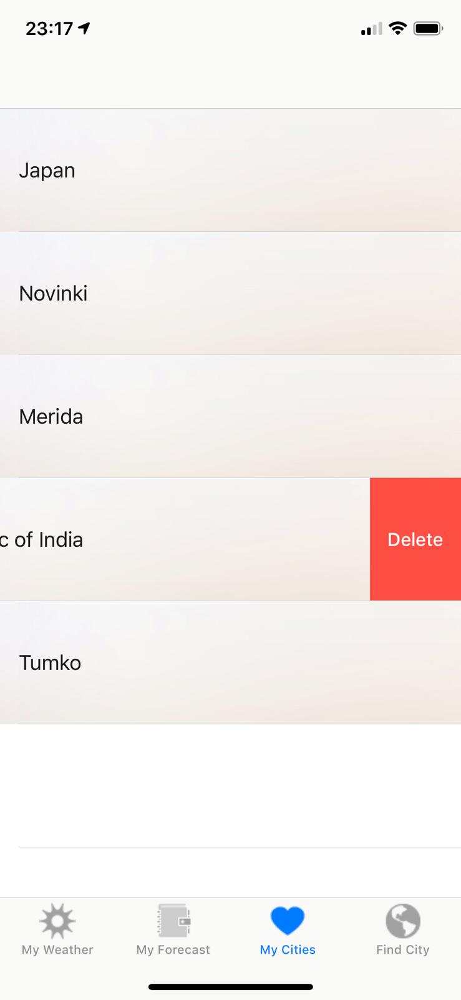

Bee Weather
This is an example how to consume an api with no third libraries.

Tested fully on iphone X 

(check constrains for other iphones)

An example using Swift

this displays the forcast for 5 days

you can search cities in the world and added to your list

you can also swipe to add a city

